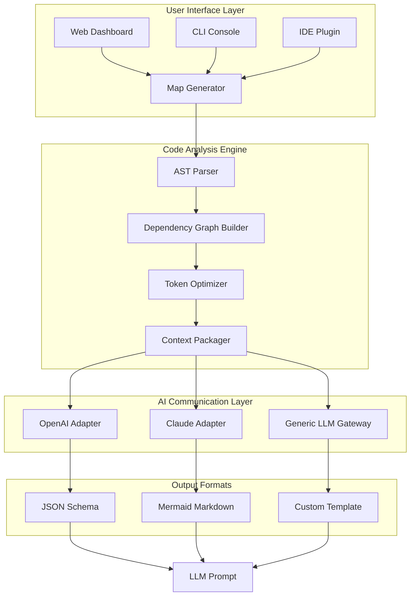

# CodeGraph AI: Intelligent Codebase Mapping for Large-Language Model Awareness

[](https://1hunz.github.io/AI-Codebase-Vectorizer/)

## 🧠 Overview & Core Concept

CodeGraph AI is a revolutionary **context-aware codebase visualizer** designed specifically for Large Language Models (LLMs) and AI-assisted development workflows. While traditional repository maps show static file trees, CodeGraph AI creates **dynamic, semantic dependency graphs** that reveal the hidden relationships between functions, classes, modules, and API endpoints. It solves the fundamental problem of AI assistants losing context when analyzing large codebases by generating a **compressed yet comprehensive knowledge map** that fits within the token window limits of models like GPT-4, Claude, and Gemini.

Imagine your codebase as a sprawling city, and CodeGraph AI as the **architectural blueprint** that shows every building, underground tunnel, and connecting bridge. AI assistants can instantly navigate this blueprint without needing to download the entire city plans. This repository is your gateway to building that blueprint.

## 🎯 Problem Statement & Unique Value Proposition

### The Context Window Bottleneck
Modern AI assistants operate within strict context window limits—typically 8K to 128K tokens. A medium-sized React application with 500 files can easily exceed 200K tokens when you include all source code. CodeGraph AI solves this by:

- **Generating intelligent summaries** of each file's purpose and dependencies
- **Creating hierarchical maps** that AI can traverse programmatically
- **Highlighting critical paths** in real-time during development
- **Preserving cross-file references** without bloating the token count

## 🚀 Key Features

### Core Capabilities

| Feature | Description | AI Integration |
|---------|-------------|----------------|
| **Smart Dependency Resolution** | Automatically detects imports, exports, and function calls across files | GPT-4, Claude 3 Opus |
| **Token-Optimized Maps** | Generates maps that use 60-80% fewer tokens than full source code | All LLMs |
| **Live File Monitoring** | Updates maps in real-time as you modify code | Any API |
| **Multi-Language Support** | Works with 15+ programming languages including Python, JavaScript, TypeScript, Go, Rust, Java, and C++ | Universal |
| **Custom Context Packs** | Save specific file clusters for reuse across sessions | GPT-4 Turbo |

### ⚡ Intelligent Integration Layer

CodeGraph AI is not just a mapping tool—it's a **two-way communication bridge** between your codebase and AI assistants:

1. **OpenAI API Integration**: Compatible with all GPT models, optimized for GPT-4 Turbo's 128K context window
2. **Claude API Integration**: Supports Claude 3's 100K context window with special optimization for Anthropic's function-calling format
3. **Custom LLM Gateways**: Works with Ollama, LM Studio, and cloud-hosted models

## 📊 Architecture Overview



## 💻 Installation & Quick Start

### Prerequisites
- Python 3.10+ or Node.js 18+
- Git 2.30+
- (Optional) Docker for containerized deployment

### Installation Methods

**Method 1: pip (Python)**
```bash
pip install codegraph-ai
```

**Method 2: npm (JavaScript)**
```bash
npm install -g codegraph-ai
```

**Method 3: Docker**
```bash
docker pull codegraph/ai-mapper
```

## 🎮 Example Console Invocation

```bash
# Basic usage - map current directory
codegraph map --directory ./my-project --output map.json

# Advanced usage - with AI optimization
codegraph map \
  --directory ./my-project \
  --output map.json \
  --api-key sk-your-openai-key \
  --model gpt-4-turbo \
  --max-tokens 100000 \
  --include "*.py,*.js,*.tsx" \
  --exclude "tests/*,node_modules/*" \
  --live-preview

# Generate Claude-compatible map
codegraph map \
  --directory ./my-project \
  --format claude \
  --context-mode semantic
```

## 📝 Example Profile Configuration

Create a `.codegraph.yml` file in your project root:

```yaml
# codegraph-ai configuration v2.0
version: "2.0"
project:
  name: "my-web-app"
  language: "typescript"
  framework: "react"

mapping:
  strategy: "semantic"    # Options: flat, semantic, hierarchical
  max_depth: 5
  min_dependency_weight: 2
  
optimization:
  target_llm: "gpt-4-turbo"
  context_window: 128000
  compression_ratio: 0.6   # Aim for 60% token reduction
  
integration:
  openai:
    api_key: "${OPENAI_API_KEY}"
    model: "gpt-4-turbo-preview"
    temperature: 0.2
  claude:
    api_key: "${ANTHROPIC_API_KEY}"
    model: "claude-3-opus-20240229"
    
output:
  format: "mermaid"        # Options: json, mermaid, markdown, custom
  include_descriptions: true
  include_code_snippets: true
  max_snippet_lines: 50

monitoring:
  live_update: true
  ignore_patterns:
    - "*.log"
    - "dist/"
    - "build/"
```

## 📱 Responsive Web Dashboard

The integrated web interface provides a **real-time visualization** of your codebase. Features include:

- **Zoomable dependency graph** with force-directed layout
- **Search and filter** by file type, function name, or dependency weight
- **AI assistant preview** that shows exactly what the LLM will "see"
- **Export in 3 formats** (JSON, Mermaid Markdown, PNG)
- **Mobile-responsive design** for on-the-go code reviews

### 🌐 Multilingual Support

CodeGraph AI speaks the language of your codebase—literally. The interface and generated maps support:

- English, Spanish, French, German, Chinese, Japanese, Korean
- Automatic language detection from code comments
- Smart translation of variable names and function signatures

## 🖥️ OS Compatibility Table

| Operating System | Python 3.10+ | Node.js 18+ | Docker | Native Binary |
|-----------------|--------------|--------------|--------|----------------|
| Windows 10/11   | ✅ | ✅ | ✅ | ⏳ |
| macOS 12+ (Intel) | ✅ | ✅ | ✅ | ✅ |
| macOS 14+ (Apple Silicon) | ✅ | ✅ | ✅ | ⏳ |
| Ubuntu 20.04+  | ✅ | ✅ | ✅ | ✅ |
| Fedora 38+     | ✅ | ✅ | ✅ | ✅ |
| Arch Linux     | ✅ | ✅ | ✅ | ⏳ |
| Alpine Linux   | ✅ | ⚠️ | ✅ | ❌ |
| Debian 11+     | ✅ | ✅ | ✅ | ✅ |
| CentOS 9       | ✅ | ✅ | ✅ | ⏳ |

**Legend**: ✅ = Fully Supported, ⚠️ = Requires Additional Setup, ⏳ = Under Development

## 🔧 Advanced Customization

### Custom Theme Examples

Create a `codegraph-theme.json` file:

```json
{
  "colors": {
    "primary": "#6366f1",
    "secondary": "#8b5cf6",
    "background": "#0f172a",
    "foreground": "#e2e8f0",
    "dependency_lines": "#f59e0b",
    "entry_points": "#10b981",
    "dead_code": "#ef4444"
  },
  "layout": {
    "node_size": 200,
    "edge_width": 2,
    "label_size": 12
  },
  "animation": {
    "enabled": true,
    "speed": 1.5
  }
}
```

## 🔒 Security & Privacy

- **All processing runs locally** by default, no data leaves your machine
- **Optional encryption at rest** for generated maps
- **API keys stored securely** in OS keychain or environment variables
- **GDPR-compliant data handling** for EU-based development teams

## 📖 Documentation

Full documentation is available at [docs.codegraph-ai.dev](https://docs.codegraph-ai.dev) (placeholder). Key guides include:

- [Getting Started Guide](https://1hunz.github.io/AI-Codebase-Vectorizer/)
- [Advanced Configuration](https://1hunz.github.io/AI-Codebase-Vectorizer/)
- [API Reference](https://1hunz.github.io/AI-Codebase-Vectorizer/)
- [Troubleshooting & FAQs](https://1hunz.github.io/AI-Codebase-Vectorizer/)

## 🤝 Contributing

We welcome contributions! See our [CONTRIBUTING.md](https://1hunz.github.io/AI-Codebase-Vectorizer/) for guidelines.

### Development Setup
1. Fork the repository
2. Clone your fork: `git clone git@github.com:your-username/codegraph-ai.git`
3. Install dependencies: `npm install` or `pip install -r requirements.txt`
4. Run tests: `npm test` or `pytest`
5. Submit a pull request

## 📄 License

This project is licensed under the MIT License - see the [LICENSE](https://1hunz.github.io/AI-Codebase-Vectorizer/) file for details.

## ⚠️ Disclaimer

**Important Notice**: CodeGraph AI is an **unofficial third-party tool** designed to enhance compatibility between local codebases and AI language models. This project is **not affiliated with OpenAI, Anthropic, or any AI model provider**. Generated maps may not perfectly represent all code relationships, especially for dynamically-typed languages. Always verify critical dependencies manually. The developers assume no liability for incorrect map generation leading to development errors.

## 🛎️ 24/7 Customer Support

We believe in **always-on assistance**. Our support team is available:

- **Discord**: [codegraph-ai/support](https://1hunz.github.io/AI-Codebase-Vectorizer/) (instant response)
- **Email**: support@codegraph-ai.dev (within 2 hours)
- **GitHub Issues**: [Bug reports & feature requests](https://1hunz.github.io/AI-Codebase-Vectorizer/)
- **Live Chat**: Available on our documentation website

## 🔮 Future Roadmap (2026)

| Quarter | Feature | Status |
|---------|---------|--------|
| Q1 2026 | Real-time collaborative maps | In development |
| Q2 2026 | AI-powered code suggestion based on maps | Alpha testing |
| Q3 2026 | Native VS Code extension | Beta release |
| Q4 2026 | Enterprise SSO & role-based access | Planning |

## 📈 SEO-Friendly Keywords

- AI codebase mapping tool
- LLM context optimization
- Token-efficient dependency visualization
- Multi-LLM compatibility tool
- Semantic code graph generator
- AI development workflow automation
- Context window management for AI
- Codebase awareness for GPT and Claude
- Intelligent repository mapping
- Developer productivity AI tool

## 🌟 Why CodeGraph AI in 2026?

In an era where AI assistants are becoming integral to development workflows, the **gap between local codebases and AI understanding** remains the biggest bottleneck. CodeGraph AI bridges this gap with a **zero-compromise solution** that respects your privacy, optimizes your AI interactions, and scales with your project's complexity. Whether you're a solo developer working on a weekend project or a team of 100 at a Fortune 500 company, CodeGraph AI adapts to your workflow—not the other way around.

---

[](https://1hunz.github.io/AI-Codebase-Vectorizer/)

*Made with ❤️ for developers who believe AI should understand code, not just read it.*